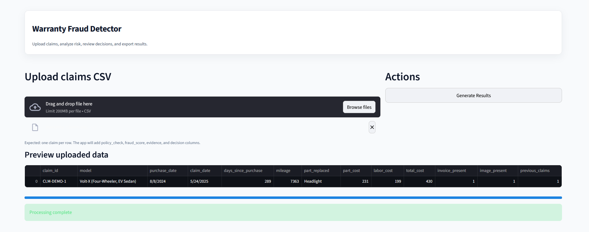
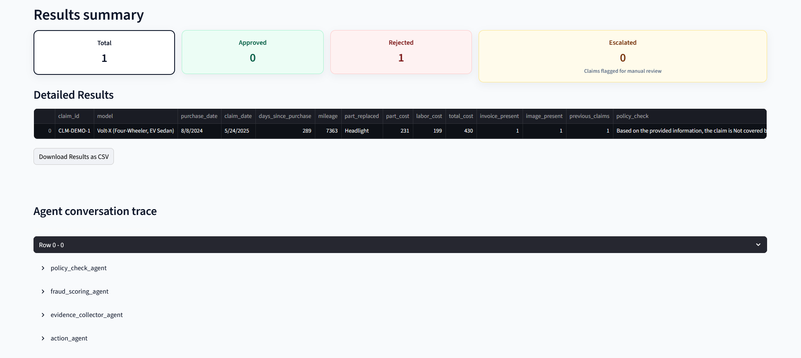

# Warranty Fraud Detection System with GenAI and LangGraph

An intelligent warranty claims adjudication system that leverages LangGraph and Groq-powered LLMs to validate warranty claims, assess fraud risk, collect supporting evidence, and make informed adjudication decisions. The system includes both a Streamlit web application and a Jupyter notebook demonstration.




## Projet Structure

- `streamlit/app.py` - Interactive web application for claims evaluation
- `agent.ipynb` - Jupyter notebook demonstrating the LangGraph StateGraph implementation with example runs
- `data/` - Sample data and policy documentation:
  - `warranty_claims.csv` - Sample warranty claims dataset
  - `AutoDrive_Warranty_Policy_2025.pdf` - Policy manual for validation rules
- `requirements.txt` -  Python package dependencies

## System Requirements

- Python 3.12+ (project was developed with modern Python 3.12.10)
- Streamlit (installed via the requirements file)
- A Groq Account
- A local virtual environment (recommended)
- Windows (instructions below use `cmd.exe`)

## Installation & Setup (Windows)

1. Open a `cmd.exe` terminal in the project directory:

2. Create and activate a virtual environment:

```cmd
python -m venv .venv
.venv\Scripts\activate
```

3. Install required dependencies:

```cmd
pip install --upgrade pip
pip install -r reqirements.txt
```

## Configuration

The application requires API keys to be configured. Create a `.env` file in the project root directory using the `.env.example` template as a reference. The system will automatically load these environment variables during runtime.

## Launching the Web Application

With the virtual environment active, execute:

```cmd
streamlit run streamlit/app.py
```

This command starts the Streamlit server and opens your default browser to the claims adjudication interface.

## Running the Demonstration Notebook

Open `agent.ipynb` in Jupyter Notebook or VS Code with Jupyter support. The notebook provides:

- Loading and preprocessing of sample claims data (`data/warranty_claims.csv`)
- Policy document processing and text extraction
- Step-by-step execution of claims through the LangGraph pipeline

Ensure your virtual environment is active and Groq API credentials are properly configured in the `.env` file for successful LLM interactions.

## Output

- **Web Application**: Interactive interface for claim submission, evaluation, and result visualization
- **Notebook**: Generates a results DataFrame with fraud scores and adjudication decisions (CSV export functionality available)

## Troubleshooting Guide

- **Streamlit launch failure**: Verify virtual environment activation and Streamlit installation
- **LLM API errors**: Check GROQ_API_KEY and GROQ_MODEL environment variables; review application logs for detailed error messages
- **Missing dependencies**: Re-run pip install -r requirements.txt and confirm the correct Python interpreter is selected

## Contact
- **Author:** Abhishek Tarun 
- **Email:** [abhishek.tarun09@gmail.com](mailto:abhishek.tarun09@gmail.com)
---
